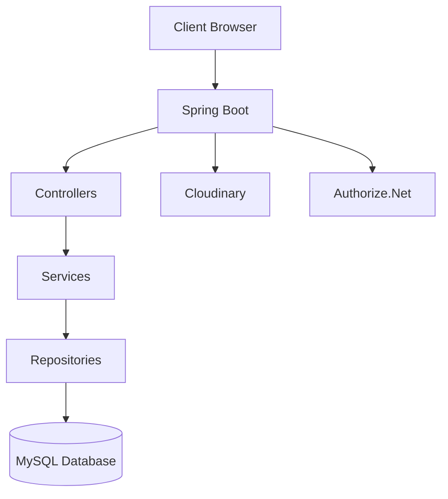

<p align="center">
  
</p>

<h1 align="center">🛒 EntityKart – E-Commerce Platform</h1>

<p align="center">
  
</p>

---

## 🚀 Badges

<p align="center">
  
  
  
  
</p>

---

## 🧑‍💻 About Project

**EntityKart** is a **production-ready full-stack e-commerce web application** built using **Spring Boot, JSP, and MySQL**.

### 🔥 Key Highlights:
- 🛍️ Complete Shopping System  
- 🔐 Secure Authentication (BCrypt)  
- 💳 Payment Integration (Authorize.Net)  
- 📦 Order Management  
- 🔄 Return & Refund System  
- 📊 Admin Dashboard  

---

## 🎯 Features

### 👤 User Features
- Registration & Login  
- OTP Password Reset  
- Profile Management  
- Address Management  

### 🛒 Shopping Features
- Product Listing & Filters  
- Cart (AJAX)  
- Wishlist  

### 📦 Orders
- Checkout Process  
- Order Tracking  
- Order History  

### 🔄 Returns
- Return Requests  
- Refund Processing  

### ⭐ Reviews
- Ratings & Reviews  
- Admin Moderation  

### 👨‍💼 Admin Panel
- Dashboard Analytics  
- Product Management  
- Order Management  
- User Management  

---

## 🏗️ Architecture



---

## 📱 EntityKart Flutter Mobile Client

A high-performance, mobile-optimized cross-platform client wrapper built with **Flutter**.

### 🌟 Key Highlights
* 📱 **Native WebView Wrapper**: Serves the shopping interface smoothly using an optimized web engine.
* ⚙️ **Dynamic IP Connection Settings**: Includes an in-app developer settings panel to configure server hosts/ports on the fly. No need to recompile the APK to switch backends.
* 🌓 **Vibrant Dark Theme**: Designed around EntityKart's signature orange brand highlights (`#FF6B35`) with modern layouts.
* 🔄 **Swipe-to-Refresh**: Native pull-to-refresh integration.
* 🔒 **Orientation Locked**: Fixed to portrait mode for consistent and clean mobile UX.

### 🛠️ Local Build Instructions
To build the Flutter APK:
1. Navigate to the `flutter/` directory:
   ```powershell
   cd flutter
   ```
2. Fetch dependencies:
   ```powershell
   & "D:\My Self Details\Programs\AI\msa_agent\tools\flutter\bin\flutter.bat" pub get
   ```
3. Compile the debug APK:
   ```powershell
   & "D:\My Self Details\Programs\AI\msa_agent\tools\flutter\bin\flutter.bat" build apk --debug
   ```
4. Find the generated APK at:
   `flutter/build/app/outputs/flutter-apk/app-debug.apk`

---

## 📊 E-Commerce Industry Comparison Summary
We conducted a deep comparative audit of EntityKart vs. global giants. The full analysis can be found in [ecommerce_analysis.txt](file:///d:/My%20Self%20Details/New%20Work/Entitykart/Entitykart/ecommerce_analysis.txt).

### 🔍 Crucial Benchmarks:
* **Architecture**: Amazon and Alibaba utilize millions of decentralized microservices. EntityKart matches this design pattern in its Spring Cloud/Kafka microservices edition, while offering a Spring Boot JSP monolith wrapper for simple B2C setups.
* **Database & Caching**: Flipkart and Amazon rely on high-volume distributed key-value/document stores (DynamoDB, Cassandra) and Redis caching layers. EntityKart uses MySQL with optional Hibernate query tuning.
* **Checkout Velocity**: Amazon's patented 1-Click checkout sets the gold standard. EntityKart implements a modern multi-step checkout workflow with cart validation, dynamic coupons, and secure Authorize.Net integration.
* **Return & Refunds**: Alibaba incorporates a peer-reviewed dispute settlement platform. EntityKart integrates return request logging with administrative dashboards and Kafka-orchestrated payment reversals.
